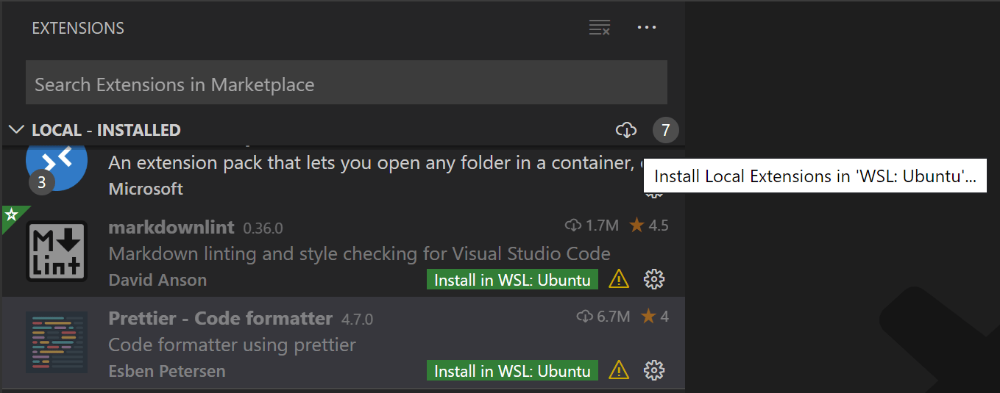

# Install tools

## Installing languages and toolsets 
Install toolsets of your choice in your WSL distro. For instance, you can run `sudo apt install python3 python3-pip` in a WSL terminal to be able to run Python code in WSL.

## Installing extensions
VS Code runs extensions in one of [two places](https://code.visualstudio.com/docs/remote/wsl#_managing-extensions): locally on the UI / client side, or in WSL.

If you install an extension from the [Extensions view](command:workbench.view.extensions), it will automatically be installed in the correct location. 

You can add locally installed extensions inside WSL by going to the [Extensions view](command:workbench.view.extensions) and using the cloud button to [Install Local Extensions in WSL](command:workbench.extensions.installLocalExtensions).

